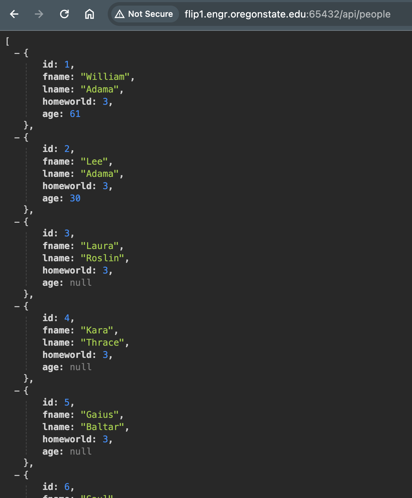
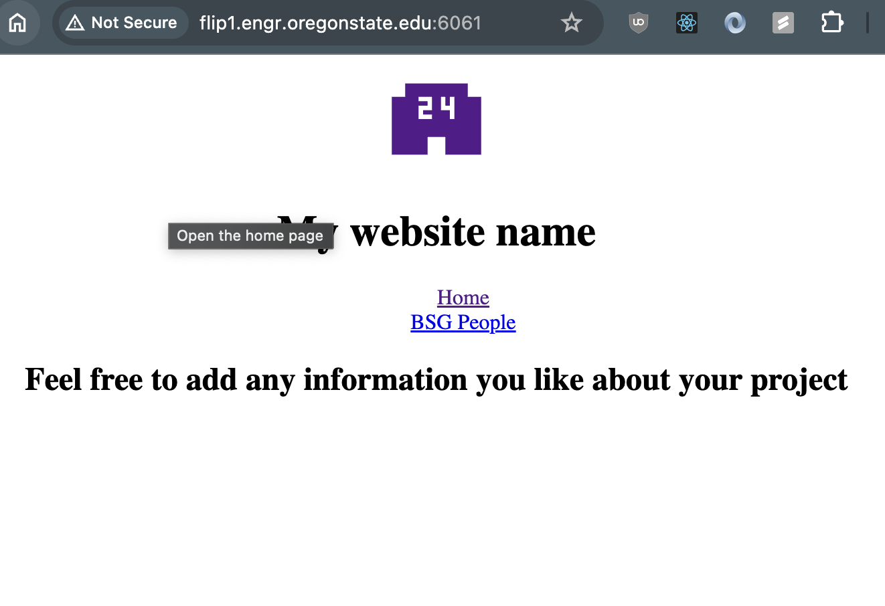
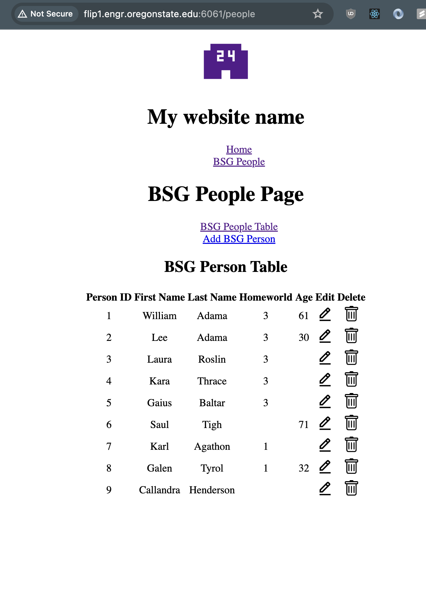
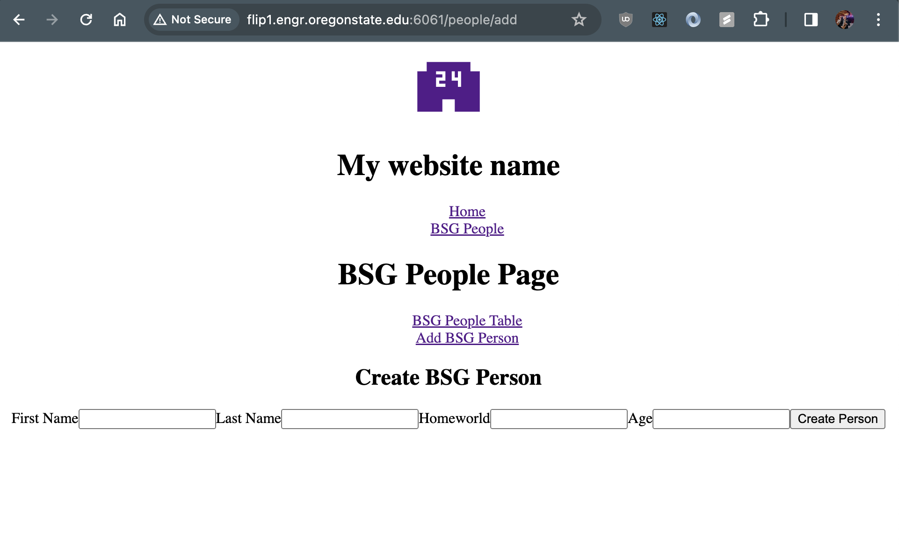

# CS 340 React Starter Guide

<!--
## Upgrades for future
* Add a comment below or remove items if needed:
- ensure that github repo lets the public clone, but not commit/change main???
- Re-build to ensure new ports work on dist
- Edit frontend tables to show better data and examples on how to JOIN and do other stuff
- Edit frontend forms to match dynamic dropdown requirement and not use typed id numbers
- Currently a tutorial for flip servers only. Modify instructions to ensure that this works with Windows or mac operating systems also.
- Update any UI screenshots if changes are made.
-
-
-
-->

<!-- Dont forget to upgrade the Table of Contents prior to Commits -->
## Table of Contents
1. [Contributions](#contributions)
2. [TLDR](#tldr)
3. [Overview](#overview)
4. [Resources](#resources)
5. [Getting Started](#getting-started)
6. [Backend Setup (Node.js/Express)](#backend-setup-nodejsexpress)
7. [Frontend Setup (Vite)](#frontend-setup-vite)
8. [React and Node.js Assignment - Connecting to a MySQL Database](#react-and-nodejs-assignment---connecting-to-a-mysql-database)
9. [Understanding Terminal Commands and NPM Scripts](#understanding-terminal-commands-and-npm-scripts)
10. [Build and Deploy](#build-and-deploy)
11. [Screenshots of Build and API Served With Forever](#build-and-api-served-with-forever)

## Contributions

This guide was developed by [Devin Daniels](https://github.com/devingdaniels) and [Zachary Maes](https://github.com/zacmaes) under the supervision of [Dr. Michael Curry](mailto:michael.curry@oregonstate.edu) and [Dr. Danielle Safonte](mailto:danielle.safonte@oregonstate.edu).


## TLDR
Assuming you are ssh logged into flip or classwork osu servers. To view the application you must be logged into the osu vpn service.
1. Clone the starter app repository: `git clone git@github.com:osu-cs340-ecampus/react-starter-app.git`
   - Follow the git guide on canvas, you may need a github personal access token

2. Navigate to the `/App` directory: `cd react-starter-app/App`

3. Set up the backend:
   - Change directory to /backend/database: `cd ../backend/database`
   - Login to MariaDB in terminal
   - In Mariadb run `source ddl.sql;`, and confirm the database is added without error. Then exit Mariadb.
   - Change directory to /backend: `cd ..`
   - Update all of your .env information locally, see [Backend Setup (Node.js/Express)](#backend-setup-nodejsexpress)
   - Install necessary packages: `npm install`
   - Launch the backend: `npm start`

4. Set up the frontend:
   - Change directory to frontend: `cd frontend`
   - Update all of your .env information locally, see [Frontend Setup (Vite)](#frontend-setup-vite)
   - Install necessary packages: `npm install`
   - Launch the frontend: `npm start`

5. Begin your development journey: Happy Hacking!

## Overview

This guide is tailored for students enrolled in CS 340 who aim to develop their final project using React.js, Node/Express, and MySQL. The goal of this repo is to provide you with the basic structure of a React/Vite + Express/Node full-stack application, including a few example SQL queries.

The starter code provided in this guide encompasses essential components such as tool setup, infrastructure for building and running your application, and guidelines for deploying your application to OSU's Flip server.

Key Assumptions:

1. You have read through and understand the [nodejs-starter-app](https://github.com/osu-cs340-ecampus/nodejs-starter-app)
   - That guide uses nodejs, express, and handlebars, but goes deeper into the inner workings of express and nodejs.
2. You have a foundational understanding of JavaScript and MySQL syntax.
3. You are adept at using terminal commands like `cd`, `ls`, `mkdir`, etc.
4. Access to OSU's flip servers and a MySQL database is available to you.
   - Note: Adaptations for local development are possible and outlined in this guide.
5. You have some familiarity with react hooks like `useState()` and `useEffect()`.
   - The code in this guide uses these hooks for state management and network requests. Examples of these are provided and described, but you may need to do more research for a better understanding of how they work.

## Resources
- [Vite Docs](https://vitejs.dev/guide/)
- [New React Docs](https://react.dev/)
- [Old React Docs](https://legacy.reactjs.org/docs/getting-started.html)
- [Express Docs](https://expressjs.com/)

- [Video - useState Hook](https://youtu.be/O6P86uwfdR0?si=dEIYE2SZFrsaFenH)
- [Video - useEffect Hook](https://youtu.be/0ZJgIjIuY7U?si=cUOxarBpQvSnswT9)
- [Video - Serving build](https://youtu.be/4pUBO31nkpk?si=C9tFJbMi-QP31IJm)
- **Videos - CRUD in React**
   1. [Part 1](https://youtu.be/T8mqZZ0r-RA?si=s2dJnArkHCkvoZml)
   2. [Part 2](https://youtu.be/3YrOOia3-mo?si=ZNYcD6Ee9KemtNFu)
   3. [Part 3](https://youtu.be/_S2GKnFpdtE?si=P8QYLMORSslHmsLn)


## Getting Started

IDE: Visual Studio Code

Browser: Chrome or Firefox are recommended, though other browsers will probably suffice.

VScode SSH extension: [Visual Studio Code SSH Documentation](https://code.visualstudio.com/docs/remote/ssh)

Terminal: The built-in terminal in VSCode works great.

Flip Server: flip 1-4 or classwork servers and ports associated with those [1024 < PORT < 65535]

OSU VPN: Access to vpn services (see canvas) required for viewing links on flip.

## Backend Setup (Node.js/Express)

1. Create a `.env` file in the root directory (`.env` should have the same indentation as `server.js`, both need to be at the root of the directory).
2. Git cloning does not include the `.env` file for obvious reasons. Here is the naming schema I would suggest (fill in with info from activity 2 - Connecting to 340 DB)):
   ```python
   DB_HOST="classmysql.engr.oregonstate.edu"  # keep this
   DB_USER="cs340_youronid"                   # replace with your onid
   DB_DATABASE="cs340_youronid"               # replace with your onid
   DB_PASSWORD="****"                         # your db password - last 4 digits of osu id number
   PORT=8500                                  # Set a port number between:[1024 < PORT < 65535]
3. `server.js` is the entry point for the backend. No changes are needed here except perhaps updating the `console.log()` statement in the `app.listen()` to reflect the FLIP server you've connected to via SSH.

4. Inside your flip server you will need to set up the `ddl.sql` file located inside `/backend/databases/` using the source command.
   ```sh
   # change directory to where the ddl.sql file is located
   cd react-starter-app/App/backend/databases  # or wherever the ddl.sql is located

   # normal login command (if not using shortcut)
   mysql -u cs340_youronid -h classmysql.engr.oregonstate.edu -p cs340_youronid

   # type in your 4 digit mariadb password and press 'enter' key
   ```

   flip will login to mariadb...
   ```
   Welcome to the MariaDB monitor.  Commands end with ; or \g.
   Your MariaDB connection id is 1359790
   Server version: 10.6.16-MariaDB-log MariaDB Server

   Copyright (c) 2000, 2018, Oracle, MariaDB Corporation Ab and others.

   Type 'help;' or '\h' for help. Type '\c' to clear the current input statement.
   ```
   Use 'show tables;' command to ensure that your database is empty, backup tables if necessary prior to moving on, drop all of your tables.
   ```sql
   MariaDB [cs340_maesz]> SHOW tables;
   Empty set (0.001 sec)
   ```
   Now you can source the ddl.sql
   ```sql
   MariaDB [cs340_maesz]> source ddl.sql;
   Query OK, 0 rows affected (0.001 sec)

   Query OK, 0 rows affected, 1 warning (0.004 sec)

   Query OK, 0 rows affected (0.007 sec)

   Query OK, 11 rows affected (0.001 sec)
   Records: 11  Duplicates: 0  Warnings: 0

   Query OK, 0 rows affected, 1 warning (0.003 sec)

   Query OK, 0 rows affected (0.005 sec)

   Query OK, 4 rows affected (0.000 sec)
   Records: 4  Duplicates: 0  Warnings: 0

   Query OK, 0 rows affected, 1 warning (0.003 sec)

   Query OK, 0 rows affected (0.006 sec)

   Query OK, 9 rows affected (0.001 sec)
   Records: 9  Duplicates: 0  Warnings: 0

   Query OK, 0 rows affected (0.007 sec)

   Query OK, 8 rows affected (0.001 sec)
   Records: 8  Duplicates: 0  Warnings: 0

   Query OK, 0 rows affected (0.000 sec)
   ```
   Confirm everything sourced with a `show tables;` command
   ```sql
   MariaDB [cs340_maesz]> show tables;
   +-----------------------+
   | Tables_in_cs340_maesz |
   +-----------------------+
   | bsg_cert              |
   | bsg_cert_people       |
   | bsg_people            |
   | bsg_planets           |
   +-----------------------+
   4 rows in set (0.001 sec)
   ```
   Exit mariadb
   ```sh
   MariaDB [cs340_maesz]> exit
   Bye
   flip3 ~/react-starter-app/App/backend/database 1010$  # We are now back in the terminal
   ```

5. Now you must install all the node dependencies outlined in the `package.json` and `package-lock.json`. Run the following commands to do this:
   
   Change directory to `/backend`, wherever that exists in your file structure.
   ```sh
   cd ~/react-starter-app/App/backend
   ```
   Use `npm install` to download everything (Some of you may have to debug this step if anything goes wrong...):
   ```sh
   flip3 ~/react-starter-app/App/backend 1023$ npm install

   # installer does some magic...

   added 122 packages, and audited 123 packages in 28s

   15 packages are looking for funding
   run `npm fund` for details

   found 0 vulnerabilities
   flip3 ~/react-starter-app/App/backend 1024$ ▌
   ```

6. Now you can start your application with the start script located in the `package.json`
   ```bash
   flip3 ~/react-starter-app/App/backend 1024$ npm start

   > backend@1.0.0 start
   > nodemon server.js

   [nodemon] 3.0.2
   [nodemon] to restart at any time, enter `rs`
   [nodemon] watching path(s): *.*
   [nodemon] watching extensions: js,mjs,cjs,json
   [nodemon] starting `node server.js`
   Server running:  http://flip3.engr.oregonstate.edu:8500...
   ▌
   ```

   This repo uses the package `nodemon` to run your program continuously. You may also install the package `forever` to accomplish this, see the [nodejs-starter-app](https://github.com/osu-cs340-ecampus/nodejs-starter-app) for instructions regarding the `forever` package.

   Remember, you must change the port numbers!

## Frontend Setup (Vite)

This section will guide you through setting up the frontend part of your application using Vite and React. Create React App has traditionally been the go to way to develop a react project, but It has been deprecated (no longer being updated or has support). Vite is the more modern bundling solution, which is what we use in this project. It is highly recomended that you read the [documentation for Vite](https://vitejs.dev/guide/) to understand how it works. It is very similar to CRA so many tutorials for CRA are still appicable to Vite projects for when you are searching the web for help.

Vite allows you to write react code, start a development server with `npm start`, and build a static `/dist` folder to serve your finished application (more on this in a later section). The scripts for these can be found or modified inside the `package.json`. Now we will walk through how to get your development server set up and running.


1. Navigate to the `/frontend` directory.
   ```sh
   flip3 ~/react-starter-app/App 1006$ cd frontend
   ```

2. Modify the fronted `.env` file so that `VITE_API_URL` matches the backend api url you created in the prior steps. Also modify the frontend `VITE_PORT` for your dev server to run on. We will cover the 
   ```python
   # Vite environment variables

   # Note: Every team member should have their own version of this file locally. Do not commit this to github 
   # in real world development scenarios, this may contain sensitve keys, that is why this is listed on .gitignore

   # PLEASE CHANGE THE PORTS TO YOUR LIKING ... between:[1024 < PORT < 65535]
   #    Remember: only one person can use a port at a time

   # This is the port used for your vite development server with `npm start` or `npm run dev`. That is configured in the the file vite.config.js
   # When you run `npm start` or `npm run dev` you can access your website on port 8501. Change this to your liking.
   VITE_PORT=8501  # Set a port number between:[1024 < PORT < 65535], this should NOT be the same as the API port.

   # This is the port used in the /frontend/reactServer.js to host your '/dist' build folder after running 'npm build', change this to your liking.
   REACT_SERVER_PORT=6061 # This is the port used in the /frontend/reactServer.js to host your '/dist' build folder... more on this later in the guide...

   # This is the url that points to your 'backend/server.js' and you must change the flip number and port to match what you set up there.
   # This url is where your SQL server code recieves and sends CRUD operations.
   VITE_API_URL='http://flip3.engr.oregonstate.edu:8500/api/'  # Change this url to match your backend express api url and port.
   ```

   The `VITE_API_URL` environment variable is used to fetch data from the backend api to this frontend application with axios in components like `PersonTable.jsx`. Here is a function from that file to demonstrate this:
   ```jsx
   // FILE: PersonTable.jsx
   const fetchPeople = async () => {
      try {
         const URL = import.meta.env.VITE_API_URL + "people";
         const response = await axios.get(URL);
         setPeople(response.data);
      } catch (error) {
         alert("Error fetching people from the server.");
         console.error("Error fetching people:", error);
      }
   };
   ```

   The `VITE_PORT` environment variable is used to modify the frontend port that this vite application runs on. This is set up inside the file `vite.config.js`. Usually the default port for vite react projects is `5173`, but we are using dotenv to modify this to a port of your choosing. You can see how this works below:

   ```js
   // FILE: vite.config.js
   import { defineConfig } from 'vite'
   import react from '@vitejs/plugin-react'
   import dotenv from 'dotenv'

   dotenv.config()

   // https://vitejs.dev/config/
   export default defineConfig({
   plugins: [react()],
   esbuild: {
      loader: "jsx"
   },
   server: {
      // Use VITE_PORT from your .env, or default to a port if not specified
      port: parseInt(process.env.VITE_PORT, 10) || 5173
   }
   })
   ```

3. Install all the frontend dependencies. This will add the `node_modules` folder so that your project can run properly.
   ```sh
   flip3 ~/react-starter-app/App/frontend 1008$ npm install
   
   # installer does some magic...

   added 284 packages, and audited 285 packages in 17s

   99 packages are looking for funding
   run `npm fund` for details

   found 0 vulnerabilities
   flip3 ~/react-starter-app/App/frontend 1008$ ▌
   ```

4. Now you are ready to start the application using the start script inside the `package.json`. When working with the Vite development server on a remote server (e.g., flip3), there are different ways to start the server and access your application, depending on whether you need local access (on the remote server itself) or external access (from your own computer or the internet).

To accomplish these options, this guide assumes that you are following the instructions for SSH through Vscode using the [Remote - SSH](https://marketplace.visualstudio.com/items?itemName=ms-vscode-remote.remote-ssh) Vscode plugin. The instructions for setting up your ssh client can be found on the Canvas Practice Resources.

With that being said, this magical VSCode plugin is able to auto-forward the ports from the remote flip server to your local machine. This means that when you start the development server on flip, VSCode can tunnel the server's port back to your local machine, so you can access it as if it were running locally via `localhost:PORT/` or `127.0.0.1:PORT/`. Please note that to view the URLs in both options below, you must be signed into the VPN.

   ### Option 1 - Local Only
   When you start the Vite server using the standard `npm run start` command, the server binds to `localhost` of the remote machine. The VSCode Remote - SSH plugin automatically detects this and sets up port forwarding, allowing you to access the server using `localhost` or `127.0.0.1` in your local machine's browser. This method keeps the server private to your local machine, and it cannot be viewed by anyone else except you.
   ```sh
   flip3 ~/react-starter-app/App/frontend 1003$ npm run start

   > cs340-react-starter-app@0.0.0 start
   > vite


   VITE v5.1.4  ready in 525 ms

   ➜  Local:   http://127.0.0.1:8501/ or http://localhost:8501/
   ➜  Network: use --host to expose
   ➜  press h + enter to show help

   h  # use h to see some options

   Shortcuts
   press r + enter to restart the server
   press u + enter to show server url
   press o + enter to open in browser
   press c + enter to clear console
   press q + enter to quit

   q  # Use q to stop vite from running and return to the terminal.

   flip3 ~/ula_cs340/winter24/react-starter-app/App/frontend 1003$ ▌

   ```

   ### Option 2 - Expose to Network
   If you need to share your development server with teammates or access it from devices other than your local machine, you can start the server with the `--host` option by running `npm start -- --host`. This tells Vite to listen on all network interfaces, making the server accessible via the remote server's public IP address. Note that VSCode will still forward this port, but now other devices can also access the server if they can reach the remote server's IP.

   ```sh
   flip3 ~/ula_cs340/winter24/react-starter-app/App/frontend 1003$ npm start -- --host

   > cs340-react-starter-app@0.0.0 start
   > vite "--host"


   VITE v5.1.4  ready in 1330 ms

   ➜  Local:   http://localhost:8501/     or http://127.0.0.1:8501/
   ➜  Network: http://128.193.36.41:8501/ or http://flip3.engr.oregonstate.edu:8501/ 
   # Now anyone with the VPN can view your dev server at these network URLs
   ➜  press h + enter to show help

   h  # use h to see some options

   Shortcuts
   press r + enter to restart the server
   press u + enter to show server url
   press o + enter to open in browser
   press c + enter to clear console
   press q + enter to quit

   q  # Use q to stop vite from running and return to the terminal.

   flip3 ~/ula_cs340/winter24/react-starter-app/App/frontend 1004$ ▌
   ```

   ### Important Note About Stopping Processes!
   While testing the command `npm start -- --host`, it was observed that using `^C` to send the `SIGINT` signal does not always lead to a clean shutdown of the Vite development server. This is because `SIGINT` may not terminate child processes spawned by Vite, leading to the server process lingering in the background.

   If you encounter issues where the server's port remains in use even after attempting to stop the server with `^C`, you can follow these steps for a more forceful shutdown:

   1. Identify the lingering process:
      - Use `lsof -i :<YOUR PORT>` to list all processes using the port.
      - Alternatively, `ps -u $(whoami)` lists all your running processes, helping identify the PID of the node process for Vite.

   2. Terminate the process:
      - Use `kill -9 <PID>` to forcefully terminate the identified process. Replace `<PID>` with the actual process ID you found in the previous step.

   **Note:** Always attempt to gracefully shut down the server using the built-in quit command (if available) or the standard `^C` method first. Resort to `kill -9` only when necessary as it terminates processes abruptly, without allowing them to clean up resources or perform a graceful shutdown. I discovered this when I exited out of my ssh session and I was still able to access my application running on `http://flip3.engr.oregonstate.edu:8501/` even though I had used `^C`. When I logged back into flip via ssh, upon trying to run `npm start -- --host` or `npm start` Vite would automatically tell me that port `8501` was still in use, and then it would start a new server on port `8502`.

   ```sh
   # use this command to see what the PID of the process is that is running on a specific port.
   flip3 ~ 1009$ lsof -i :8501
   # Our runaway process is identified as 2502508
   COMMAND     PID  USER   FD   TYPE    DEVICE SIZE/OFF NODE NAME
   node    2502508 maesz   22u  IPv6 357398260      0t0  TCP *:cmtp-mgt (LISTEN)
   node    2502508 maesz   29u  IPv6 357423874      0t0  TCP flip3.engr.oregonstate.edu:cmtp-mgt->10-197-151-117.sds.oregonstate.edu:64081 (ESTABLISHED)
   node    2502508 maesz   30u  IPv6 357944796      0t0  TCP flip3.engr.oregonstate.edu:cmtp-mgt->10-197-151-117.sds.oregonstate.edu:64620 (ESTABLISHED)

   # use this command to see all of your running processes
   flip3 ~ 1010$ ps -u $(whoami)
       PID TTY          TIME CMD
   2501520 ?        00:00:00 systemd
   2501523 ?        00:00:00 (sd-pam)
   2501554 ?        00:00:00 sshd
   2501556 pts/393  00:00:00 bash
   2502508 pts/393  00:00:03 node  # This is our runaway process 2502508
   2502541 pts/393  00:00:01 esbuild
   2512357 ?        00:00:00 sh
   2512428 ?        00:00:09 node
   2513575 ?        00:00:04 node
   2517189 ?        00:00:00 sshd
   2517190 ?        00:00:00 bash
   2517570 ?        00:00:00 bash
   2517908 ?        00:00:18 node
   2517920 ?        00:00:00 node
   2518045 ?        00:00:04 node
   2518267 ?        00:00:00 sshd
   2518272 ?        00:00:00 bash
   2518654 ?        00:00:00 bash
   2518673 ?        00:00:00 code-903b1e9d89
   2518719 ?        00:00:00 sh
   2518721 pts/464  00:00:00 bash
   2552243 pts/525  00:00:00 bash
   2556916 ?        00:00:01 node
   2574369 ?        00:00:00 sshd
   2574370 pts/455  00:00:00 bash
   2614401 ?        00:00:00 sleep
   2615639 pts/455  00:00:00 ps

   # use this command to kill the process with the PID
   flip3 ~ 1011$ kill -9 2502508
   ```


## React and Node.js Assignment - Connecting to a MySQL Database
Now that your application is set up and running, this section will guide you through adding a diagnostic API endpoint to your Node.js Express backend and displaying its data on your React application's homepage. This integration will ensure your backend and database are correctly configured and communicating with your frontend.

### Step 1: Backend Setup
First, ensure you have MySQL installed and set up in your environment. Then, install the MySQL package in your `/backend` directory if you haven't already with `npm install mysql --save`.

### Step 2: Create Diagnostic Route
In your `/backend/server.js` file, import your database connector and define a new `GET` request route at `/api/diagnostic` that performs a series of database operations:
```javascript

// Match to your database config route
const db = require('./database/config.js');

// define a new GET request with express:
app.get('/api/diagnostic', async (req, res) => {
  try {
    // Await your database queries here
    await db.pool.query('DROP TABLE IF EXISTS diagnostic;');
    await db.pool.query('CREATE TABLE diagnostic(id INT PRIMARY KEY AUTO_INCREMENT, text VARCHAR(255) NOT NULL);');
    await db.pool.query('INSERT INTO diagnostic (text) VALUES ("MySQL is working!")');
    const results = await db.pool.query('SELECT * FROM diagnostic;');

    // res.json() automatically stringifies the JavaScript object to JSON
    res.json(results);

  } catch (error) {
    // Handle Errors
    console.error('Database operation failed:', error);
    res.status(500).send('Server error');
  }
});

```

### Step 3: Frontend Setup
Update the HomePage Component by modifying `/frontend/HomePage.jsx` to fetch and display data from the endpoint you created at `/api/diagnostic`.

```javascript
import { useState, useEffect } from 'react';  // import the hooks you are going to use
import axios from 'axios';

// Define the HomePage component
function HomePage() {
  // useState hook to initialize the diagnosticData state variable to store the fetched data
  const [diagnosticData, setDiagnosticData] = useState([]);

  // Define a function to fetch diagnostic data from the API
  const fetchDiagnosticData = async () => {
    try {
      // Construct the URL for the API call
      const URL = import.meta.env.VITE_API_URL + 'diagnostic';
      // Use Axios to make the GET request
      const response = await axios.get(URL);
      // Update state with the response data
      setDiagnosticData(response.data);
    } catch (error) {
      // Handle any errors that occur during the fetch operation
      console.error('Error fetching diagnostic data:', error);
      alert('Error fetching diagnostic data from the server.');
    }
  };

  // useEffect hook to trigger the fetchDiagnosticData function when the component mounts
  useEffect(() => {
    fetchDiagnosticData();
  }, []);

  // Determine content based on diagnosticData length from the fetch action
  let content;
  if (diagnosticData === null) {
    content = <p>Loading diagnostic data...</p>; // Show while data is null
  } else if (diagnosticData.length === 0) {
    content = <p>No diagnostic data found.</p>; // Show if data is an empty array
  } else {
    content = <pre>{JSON.stringify(diagnosticData, null, 2)}</pre>;
  }

  // display the content and anything else
  return (
    <>
     <h2>Diagnostic Data</h2>
      {content}

     <h2>Feel free to add any information you like about your project</h2>
    </>
  );
}
export default HomePage;
```

### Testing the DB Integration
Now that you have set up the express backend route and frontend Homepage fetch, you should now be able to see this when you `npm run start` the dev servers for both backend and frontend.

1. Start your backend server and ensure it's running without errors.
2. Start your React frontend and navigate to the homepage.
3. You should see the diagnostic data displayed on the page, confirming that the backend and frontend are correctly integrated.
4. In the browser dev tools network tab you should see the fetch to `/api/diagnostic` with its request and response.
5. You should see any console.log() statements you added in the backend code in the terminal on flip where the server.js is running.

### Building and Submitting the Assignment
By following these steps, you've successfully added a diagnostic API endpoint to your backend and displayed its response in your React frontend. This setup is a foundational step towards building full-stack web applications that require backend and frontend integration. Once you are satisfied that the frontend application is communicating with the backend server.js in the `npm run start` defined dev servers, you will need to take steps to build and serve a working URL that other people on the OSU VPN may observe the functionality of the diagnostic fetch. Any URLs you created with `npm run start` do not persist once you log out of the ssh session on the flip servers. **The link you submit to canvas will need to stay live and functional for TAs and Instructors to complete their grading.** You may choose to modify the configurations of this repo to fit your specific needs for using various OSU servers (flip1, flip2, classwork, etc...). Please refer to the remaining sections below to learn how to build and deploy your react application. The section [Build and Deploy](#build-and-deploy) should help you get started on that.


## Understanding Terminal Commands and NPM Scripts
The `package.json` files in both the `/frontend` and `/backend` directories of our project serve as a manifest for project settings, dependencies, and, importantly, scripts that automate tasks. These scripts are custom commands defined under the `"scripts"` property and can be executed using npm or npx, simplifying the development and deployment processes. In this section we will iteratively learn about the various ways you can start up a project server, and how these can be traslated into efficient npm scripts.

### Command - `node`

To set a foundation for why npm scripts make development more efficient, let's first look at how you would start up the `backend/server.js` the traditional way using the command `node server.js`:

```sh
flip3 ~/react-starter-app/App/backend 1025$ node server.js
Server running:  http://flip3.engr.oregonstate.edu:65432...
▌
```
You will notice that this command takes over your terminal until you send the `control + C` | `^C` | `SIGINT` command. Another disadvantage of using `node server.js` is that when you make changes to the code, you must stop and restart the process before you can see those changes.

Now you might be saying to yourself, "Can't I just use `nodemeon` to solve this?"... YES!

### Command - `nodemon`

Let's now look at how you would use `nodemon` in the traditional method. In your backend terminal, you would use the command `npx nodemon server.js` like this:
```sh
flip3 ~/react-starter-app/App/backend 1027$ npx nodemon server.js
[nodemon] 3.0.2
[nodemon] to restart at any time, enter `rs`
[nodemon] watching path(s): *.*
[nodemon] watching extensions: js,mjs,cjs,json
[nodemon] starting `node server.js`
Server running:  http://flip3.engr.oregonstate.edu:65432...

# I made some changes and saved my code...
[nodemon] restarting due to changes...
[nodemon] starting `node server.js`
Server running:  http://flip3.engr.oregonstate.edu:65432...

# I made some changes and saved my code...
[nodemon] restarting due to changes...
[nodemon] starting `node server.js`
Server running:  http://flip3.engr.oregonstate.edu:65432...

# I made some changes and saved my code...
[nodemon] restarting due to changes...
[nodemon] starting `node server.js`
Server running:  http://flip3.engr.oregonstate.edu:65432...
▌
```

This now allows us to utilize `nodemon's` hot module reloding (HMR) which automatically restarts the server when code changes are saved. `npx` is a command-line utility bundled with `npm` that executes local node packages. It allows you to run any command available in a local `node_modules` without globally installing the packages or adding them to your `bash_profile` or `bashrc` files. `nodemon` is great, but we still have a problem in that our terminal has been taken over until `control + C` has stopped the process. Another problem is that once we exit out of the terminal or the ssh session on flip, the server will stop running and we will no longer be able to view our active URL. This is where the package `forever` will come in handy.

### Installing - `forever`

The package `forever` allows us to run multiple processes forever which will run outside of a terminal or ssh instance. This package is currently already listed in both `frontend/package.json` and `backend/package.json` dependencies, so when you ran `npm install` earlier, it should have installed that in both `/frontend` and `/backend` for you to be able to access. If for some reason this didn't happen, you can install it directly with `npm install forever --save`.

> You must run any forever commands from the root of your project (where server.js is located). If you don't it will fail. For this project, that is `/backend` or `/frontend`

For reasons beyond your control, running `forever` is a bit more complex on the school's FLIP server. Here is how to make it easy, run the following command from the root of your project (`/backend` or `/frontend`):

```bash
alias forever='./node_modules/forever/bin/forever'
```

Now, whenever you run `forever` from the *root* of any project that has the forever dependency installed, it will work, without fail. If you want to make this more permanent (not absolutely permanent), you can add this as a line towards the end of the `~/.bashrc` file in your home directory (notice the ~ squiggly) on the OSU FLIP server.


Now that we have `forever` installed, let's look at the commands that you might use.

### Command - `forever start server.js`

Running the command `forever start server.js`, is similar to running the command `node server.js` that we learned about prior to this. A difference is that it does not run in the foreground of our terminal, but instead runs in the background. Another difference is that `forever` will automatically restart your application if there are any issues. With this command you can safely exit out of your flip ssh session and submit urls to canvas for other to view them. You can see below how our terminal prompt returns to the screen for us to be able to type further commands of our choice. Runing `forever start server.js` can be done for any nodejs application that you want to start up.

```sh
flip3 ~/react-starter-app/App/backend 1032$ forever start server.js 
# I have found that these warnings can be safely ignored...so far...
# The warnings will show up every time you run a forever command, they have not caused breaking issues for me yet...
warn:    --minUptime not set. Defaulting to: 1000ms
warn:    --spinSleepTime not set. Your script will exit if it does not stay up for at least 1000ms
info:    Forever processing file: server.js
(node:4115889) Warning: Accessing non-existent property 'padLevels' of module exports inside circular dependency
(Use `node --trace-warnings ...` to show where the warning was created)
(node:4115889) Warning: Accessing non-existent property 'padLevels' of module exports inside circular dependency

flip3 ~/react-starter-app/App/backend 1033$ ▌  # we can continue to do things in the terminal prompt!
```

### Command - `forever list`

To see a list of your current processes in `forever`, you can use the command `forever list` like this:
```sh
flip3 ~/react-starter-app/App/backend 1002$ forever list
(node:4144017) Warning: Accessing non-existent property 'padLevels' of module exports inside circular dependency
(Use `node --trace-warnings ...` to show where the warning was created)
(node:4144017) Warning: Accessing non-existent property 'padLevels' of module exports inside circular dependency

info:    Forever processes running
data:        uid  command                                                    script    forever pid     id logfile                                 uptime      
data:    [0] z8Fa /nfs/stak/users/maesz/.nvm/versions/node/v16.13.0/bin/node server.js 4143975 4144005    /nfs/stak/users/maesz/.forever/z8Fa.log 0:0:0:2.781 
flip3 ~/react-starter-app/App/backend 1003$ ▌
```
Depending on what you have running, this might show multiple processes. There are many values that you can look at here including the location of your logs at `logfile`, but also take note of the index value for this process which is `[0]`, you will need this in the next section...

### Command - `forever stop <index>`
If you need to stop a process, like the one running above at index `[0]`, you can use the command `forever stop <index>` (ie - `forever stop 0`) to accomplish this:

```sh
flip3 ~/react-starter-app/App/backend 1012$ forever stop 0
(node:4147301) Warning: Accessing non-existent property 'padLevels' of module exports inside circular dependency
(Use `node --trace-warnings ...` to show where the warning was created)
(node:4147301) Warning: Accessing non-existent property 'padLevels' of module exports inside circular dependency

info:    Forever stopped process:
    uid  command                                                    script    forever pid     id logfile                                 uptime      
[0] 30Nc /nfs/stak/users/maesz/.nvm/versions/node/v16.13.0/bin/node server.js 4147194 4147226    /nfs/stak/users/maesz/.forever/30Nc.log 0:0:0:5.311 
flip3 ~/react-starter-app/App/backend 1013$ ▌
```
This command can be used to stop any of the indexes (0, 1, 2, 3 , etc.)

### Command - `forever restart <index>`

In the same way that you can stop a process by its index, you can also restart a process by its index. This is useful if you made changes or something broke and you needed to restart.

```sh
flip3 ~/react-starter-app/App/backend 1027$ forever restart 0
(node:4158785) Warning: Accessing non-existent property 'padLevels' of module exports inside circular dependency
(Use `node --trace-warnings ...` to show where the warning was created)
(node:4158785) Warning: Accessing non-existent property 'padLevels' of module exports inside circular dependency

info:    Forever restarted process(es):
data:        uid  command                                                    script    forever pid     id logfile                                 uptime      
data:    [0] QH6j /nfs/stak/users/maesz/.nvm/versions/node/v16.13.0/bin/node server.js 4158690 4158716    /nfs/stak/users/maesz/.forever/QH6j.log 0:0:0:5.315 
flip3 ~/react-starter-app/App/backend 1028$ ▌
```

This command can be used to restart any of the indexes (0, 1, 2, 3 , etc.)

### Command - `forever stopall`
This command will stop every single forever process that is running, **use with caution!** You will notice below that I happened to have four processes running and it stopped all of them. Again, **use with caution!!**
```sh
flip3 ~/react-starter-app/App/backend 1024$ forever stopall
(node:4155732) Warning: Accessing non-existent property 'padLevels' of module exports inside circular dependency
(Use `node --trace-warnings ...` to show where the warning was created)
(node:4155732) Warning: Accessing non-existent property 'padLevels' of module exports inside circular dependency

info:    No forever processes running
info:    Forever stopped processes:
data:        uid  command                                                    script                          forever pid     id logfile                                 uptime                   
data:    [0] n34E /nfs/stak/users/maesz/.nvm/versions/node/v16.13.0/bin/node reactServer.cjs                 4154645 4154671    /nfs/stak/users/maesz/.forever/n34E.log 0:0:1:12.748000000000005 
data:    [1] KgCi /nfs/stak/users/maesz/.nvm/versions/node/v16.13.0/bin/node server.js                       4154727 4154768    /nfs/stak/users/maesz/.forever/KgCi.log 0:0:1:6.221000000000004  
data:    [2] 3z2l /nfs/stak/users/maesz/.nvm/versions/node/v16.13.0/bin/node controllers/peopleController.js 4155077 4155102    /nfs/stak/users/maesz/.forever/3z2l.log STOPPED                  
data:    [3] eoEG /nfs/stak/users/maesz/.nvm/versions/node/v16.13.0/bin/node database/config.js              4155426 4155517    /nfs/stak/users/maesz/.forever/eoEG.log STOPPED                  
flip3 ~/react-starter-app/App/backend 1025$ ▌
```

As you can see, `forever` is a very powerful tool that can help us while we develop the react application. Now let's take a look at how npm scripts will help us to simplify all these commands.

### NPM Scripts Inside the `/backend/package.json`

Inside our various `package.json` files we can name and define any script that we want the `npm` command to execute. Here is part of the `backend/package.json` file where I have created two custom scripts called `"start"` and `"serve"`:
```json
{
  "name": "cs340-react-starter-app-backend",
  "version": "1.0.0",
  "description": "This is the backend express API that connects the frontend to the mariadb database",
  "main": "server.js",

  "scripts": {
    "start": "nodemon server.js",
    "serve": "npx forever start server.js"
  },
  ...
```
### Command - npm run start
If we run the command `npm run start`, node package manager will look inside the `"scripts"` section of the `package.json` and find the `"start"` command `nodemon server.js`. Notice how we are utilizing `nodemon` to take advantage of its development features like HMR. `npm run start` will be the command that you run to start the backend server while you are actively working on code. This command will NOT permanently serve the api. So if you ran `npm run start` (ie `nodemon`) and exited out of the flip ssh session, your server would no longer be running.

```sh
flip3 ~/react-starter-app/App/backend 1004$ npm run start

> cs340-react-starter-app-backend@1.0.0 start
> nodemon server.js

[nodemon] 3.0.2
[nodemon] to restart at any time, enter `rs`
[nodemon] watching path(s): *.*
[nodemon] watching extensions: js,mjs,cjs,json
[nodemon] starting `node server.js`
Server running:  http://flip3.engr.oregonstate.edu:65432...
▌
```

### Command - `npm run serve`

When you need a url to stay active for days (in the case of submitting a project step), you will need to utilize the `"serve"` script which is basically just the command `npx forever start server.js`. As we learned in the prior section, forever will allow our program to run continuously in the background and restart it if necessary. To utilize this npm script, you will run the command `npm run serve` like this:

```sh
flip3 ~/react-starter-app/App/backend 1011$ npm run serve

> cs340-react-starter-app-backend@1.0.0 serve
> npx forever start server.js

warn:    --minUptime not set. Defaulting to: 1000ms
warn:    --spinSleepTime not set. Your script will exit if it does not stay up for at least 1000ms
info:    Forever processing file: server.js
(node:764027) Warning: Accessing non-existent property 'padLevels' of module exports inside circular dependency
(Use `node --trace-warnings ...` to show where the warning was created)
(node:764027) Warning: Accessing non-existent property 'padLevels' of module exports inside circular dependency
flip3 ~/ula_cs340/winter24/react-starter-app/App/backend 1012$ 
▌
```
> The `npx` could potentially cause issues for some of you. If it does not work you could try editing the `"serve"` script in the `backend/package.json` to look like this: `"serve": "forever start server.js"` which just removes the `npx` command.

Now you should have a solid understanding of all the commands and scripts that can be used to run the `/backend` server. We will now take a closer look at the scripts specific to the `/frontend` vite react project.


### NPM Scripts Inside the `/frontend/package.json`
<!-- I am unable to get the anchor tag for npm run start working... -->
We already covered the `"start"` script in a the prior section [Command - npm run start](#Command--npm-run-start). In our `/frontend/package.json` you will notice a lot of other scripts that will be very useful for development. Again, you are allowed to modify these scripts to your needs, but I would recommend leaving the `"start"` and `"build"` commands as is because they are utilizing built in vite tooling.
```json
{
  "name": "cs340-react-starter-app-frontend",
  "private": true,
  "version": "0.0.0",
  "type": "module",
  "scripts": {
    "start": "vite",
    "build": "vite build",
    "serve": "npx forever start reactServer.cjs",
    "lint": "eslint . --ext js,jsx --report-unused-disable-directives --max-warnings 0",
    "preview": "vite preview"
  },
```

#### `"start": "vite"`
- **What It Does:** This script starts a local development server for your Vite React application.
- **How It Works:** By running `npm run start`, Vite serves your application with hot module replacement (HMR), which means your changes will be updated live without needing to refresh your browser. This essentially runs the terminal command `vite`.
- **Use Case:** Use this command while actively developing your application to see your changes in real-time.
- This was covered in the prior [Option 1 - Local Only section](#option-1---local-only)

#### `"build": "vite build"`
- **What It Does:** Builds your application for production.
- **How It Works:** Running `npm run build` compiles your React application into static files optimized for production, typically into a `/dist` directory.
- **Use Case:** Run this script when you are ready to deploy your application, creating a version that's optimized for speed and efficiency.
- This is explained more specifically in the next [Build and Deploy Section](#build-and-deploy)

#### `"serve": "npx forever start reactServer.cjs"`
- **What It Does:** Uses `forever` to serve your production build continuously via a custom express application called `reactServer.cjs`. 
   - Note: commonJS is required here because of our package.json definition of `"type": "module"`. It is also possible to use ES6, but that is not covered in this guide.
- **How It Works:** After building your application with `npm run build`, run this script `npm run serve` to start the api `reactServer.cjs` that serves your built application located in the `/dist` folder. The forever tool ensures that this server runs continuously, even if the script crashes or the server is restarted.
- **Use Case:** Ideal for when you need your built application to be accessible over the internet for extended periods (For example, when submitting a project step).
- This is explained more specifically in the next [Build and Deploy Section](#build-and-deploy)

#### `"lint": "eslint . --ext js,jsx --report-unused-disable-directives --max-warnings 0"` (NOT REQUIRED TO USE)
- **What It Does:** Lints your JavaScript and JSX files to ensure code quality and consistency.
- **How It Works:** This script runs ESLint on all .js and .jsx files in your project, enforcing your coding standards. Run it with `npm run lint`. The --report-unused-disable-directives flag reports ESLint disable comments that don't actually suppress any errors, and --max-warnings 0 treats warnings as errors, failing the script if any are found.
- **Use Case:** Run this command to check for and fix linting errors in your codebase, ideally before committing your code. 
- This is automatically provided by vite and is not required, but you might find useful. This guide will not discuss this script further, use at your own risk.

#### `"preview": "vite preview"` (NOT REQUIRED TO USE)
- **What It Does:** Serves your production build locally for testing.
- **How It Works:** After building your project with `npm run build`, this script serves the production version of your application from a local server, allowing you to test the built site before deploying it. Run this with `npm run preview`.
- **Use Case:** Use this to preview the final version of your site in a production-like environment, verifying that everything works as expected before an actual deployment. 
- This is automatically provided by vite and is not required, but you might find useful. This guide will not discuss this script further, use at your own risk.


Remember, you can always edit these scripts to fit your project needs. These are not set in stone, and they are more like preferences that you get to decide on. For example, you might find that you are not using `forever` but instead using `pm2` (not covered in this guide). This would require you to change the `"serve"` script to reflect your use of the `pm2` package. In theory you can create and name any script you want. For example, if you wanted to use `nodemon` to test if `reactServer.cjs` is working prior to serving it with `forever`, you would create a new script inside the package.json file like this: `"nodemon-server": "nodemon reactServer.cjs"` and then run it in the terminal with the command `npm run nodemon-server`.
> Implementing the nodemon-server script will be left as an exercise for the student. It may require additional configuration.

Now that we have a high level overview of the `/frontend` npm scripts, let's take a closer look at how the `"build"` and `"serve"` script will work for this react project.

## Build and Deploy

There are hundreds of ways to serve your applications which include but are not limited to the flip servers, netlify, vercel, heroku, google cloud, or even hardware solutions like raspberry pis. This guide will show you how to serve specifically with vite, express, forever, and the flip server. You essentially build your react application with `vite build` then statically serve the build folder (`/dist`) using the express server `reactServer.cjs`. This express server will run in parallel to your `/backend` express mariadb server that we configured in the prior section. At the end of the day, you are running two servers at two different ports.

This video goes through a very simple react/express application that covers the philosophy of this build process for the frontend server.
[Serve a React app from an Express server | React frontend and Express API setup in 1 project!](https://youtu.be/4pUBO31nkpk?si=3oeBA1u3tScOvNA0)

If you have not done so already, open up your `/frontend/.env` file and set a port number for the `REACT_SERVER_PORT` variable and save the file. If you recall from the [Frontend Setup (Vite) section](#frontend-setup-vite), our .env file sould look like this (change the ports to ones you are going to use)
   ```python
   VITE_API_URL='http://flip3.engr.oregonstate.edu:8500/api/'  # Change this url to match your backend express api url and port.
   VITE_PORT=8501  # Set a port number between:[1024 < PORT < 65535], this should NOT be the same as the API port.
   REACT_SERVER_PORT=6061 # This is the port used in the /frontend/reactServer.js to host your '/dist' build folder. [1024 < PORT < 65535]
   ```

Looking inside of the file `reactServer.cjs`, we will find a very small express server that has one function. This will server our static build files located inside the `/dist` folder.

#### reactServer.cjs:
```js
// reactServer.cjs
// Uses common javascript to serve the react build folder (/dist)

const express = require('express');
const path = require('path');
const app = express();
require("dotenv").config();

// Use the custom 'REACT_SERVER_PORT' port from .env, with a fallback to 3001
const PORT = process.env.REACT_SERVER_PORT || 3001;

// Serve the static files from the React app located in the build folder '/dist'
// React router will take over frontend routing
app.use(express.static(path.join(__dirname, 'dist')));

// Handles any requests that don't match the ones above to return the React app
// A request to '/nonExist' will redirect to the index.html where react router takes over at '/'
app.get('*', (req, res) => {
  res.sendFile(path.resolve(__dirname, 'dist', 'index.html'));
});

app.listen(PORT, () => {
    // Change this text to whatever FLIP server you're on
    console.log(`Server running:  http://flip3.engr.oregonstate.edu:${PORT}...`);
  });
```

Please take notice of two things here in the `reactServer.cjs`:
1. We create a `PORT` variable for the server to run on that peers into our .env file and pulls out the dotenv variable `REACT_SERVER_PORT` that we just defined.
2. We use `app.use(...)` and `app.get('*', ...)` to point every url endpoint to our static files located at `/dist` and that folder's `index.html`.

We will see how this works soon, but first we must build our `/dist` folder. Use the command `npm run build` to do this.

```sh
# Build the '/dist' folder...
flip3 ~/react-starter-app/App/frontend 1022$ npm run build

> cs340-react-starter-app@0.0.0 build
> vite build

vite v5.1.4 building for production...
✓ 93 modules transformed.
dist/index.html                   0.45 kB │ gzip:  0.30 kB
dist/assets/index-vBDqSkg8.css    0.11 kB │ gzip:  0.11 kB
dist/assets/index-bVtY9NLx.js   201.19 kB │ gzip: 67.30 kB
✓ built in 6.16s
flip3 ~/react-starter-app/App/frontend 1023$ ▌
```
> You should now see a `/dist` folder was created in the `/frontend` directory!

Every time you run the command `npm run build` it will replace your old `/dist` with a new version containing all of your newly saved react code and assets. Be careful with this command becasue you will lose the old version of `/dist` that you may have running on your older server. 

#### Serving the Vite dist:

Now that you have built your `/dist` folder, this static build can be served hundreds of different ways. Since we are already running the express backend on a different flip port, we will use our frontend express server `reactServer.cjs` to serve the `/dist` build folder at a port of our choosing. There is a serve command built into the frontend package.json that will automatically use forever to start up `reactServer.cjs`.
```sh
# Serve the frontend dist build
flip1 ~/react-starter-app/App/frontend 583$ npm run serve

> cs340-react-starter-app-frontend@0.0.0 serve
> npx forever start reactServer.cjs

warn:    --minUptime not set. Defaulting to: 1000ms
warn:    --spinSleepTime not set. Your script will exit if it does not stay up for at least 1000ms
info:    Forever processing file: reactServer.cjs
(node:1702055) Warning: Accessing non-existent property 'padLevels' of module exports inside circular dependency
(Use `node --trace-warnings ...` to show where the warning was created)
(node:1702055) Warning: Accessing non-existent property 'padLevels' of module exports inside circular dependency
flip1 ~/react-starter-app/App/frontend 584$ ▌
```

> Assuming that you have the backend server running, if you run the command `forever list` you should see both processes for frontend and backend.

> Your Website is now visible at the flip server and port number that you set up in `.env`.
```sh
flip1 ~/react-starter-app/App/frontend 584$ forever list
(node:1702689) Warning: Accessing non-existent property 'padLevels' of module exports inside circular dependency
(Use `node --trace-warnings ...` to show where the warning was created)
(node:1702689) Warning: Accessing non-existent property 'padLevels' of module exports inside circular dependency
info:    Forever processes running
data:        uid  command                                                    script          forever pid     id logfile                                 uptime                    
data:    [0] xdT7 /nfs/stak/users/maesz/.nvm/versions/node/v16.13.0/bin/node server.js       1701949 1701965    /nfs/stak/users/maesz/.forever/xdT7.log 0:0:10:59.63900000000001  
data:    [1] 9f1d /nfs/stak/users/maesz/.nvm/versions/node/v16.13.0/bin/node reactServer.cjs 1702085 1702100    /nfs/stak/users/maesz/.forever/9f1d.log 0:0:10:41.789999999999964 
flip1 ~/react-starter-app/App/frontend 585$ ▌
```

## Build and API Served With Forever

Here are some images of what the stock build of this website will look like.

### API On Separate Port


### Homepage


### BSG People Page


### Add Person Page


### Update Person Page


<!-- ## Testing

Please note that testing is outside the scope of this project and course and will not be covered in this guide.

## Git

Please see the git and github guide and videos on Canvas.


## Troubleshooting

[List common issues that may arise and their potential solutions.]

## Additional Resources

[Include links or references to additional reading materials or tutorials.]

## Conclusion

[Summarize the purpose of the guide and what students should have achieved upon completion.] -->

